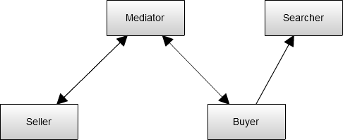

# Gaia

## Agents

## Roles

### Seller

#### Description

Sells items on market

### Bidder

#### Description

Bid items on market

### Searcher

#### Description

Search for items

#### Permissions

- reads auctions

### Mediator

#### Description

Our platform auctioneer

#### Permissions

- changes auctions
- changes bids

#### Responsibilities

##### Safety

- exists(auction_id)
- exists(winner_id)
- exists(seller_id)
- exists(bidder_id)
- description.length > 0
- min_price > 0
- price > Auction.higest_bid

## Protocol

- notifyWinnerOfAuction()
  - Description: Called when bidder winns an auction
  - Initiator: Mediator
  - Partner: Bidder
  - Input: *{auction_id: Integer, price: Integer}*
  - Output: Void
- notifyLoserOfAuction()
  - Description: Called when bidder loses an auction
  - Initiator: Mediator
  - Partner: Bidder
  - Input: *{auction_id: Integer, price: Integer, winner_id: Integer}*
  - Output: Void
- notifyNotHighestBidder()
  - Description: Called when bidder doesn't have the higest bid
  - Initiator: Mediator
  - Partner: Bidder
  - Input: *{auction_id: Integer, price: Integer}*
  - Output: Void
- makeBid()
  - Description: Bid on an item
  - Initiator: Bidder
  - Partner: Mediator
  - Input: *{auction_id: Integer, price: Integer, bidder_id: Integer}*
  - Output: {status: STATUS}
- searchForItem()
  - Description: Search for an item
  - Initiator: Bidder
  - Partner: Searcher
  - Input: *{query: String}*
  - Output: *{item_id: Integer}*
- notifyAboutEndedAuction()
  - Description: Information about an ended auction
  - Initiator: Mediator
  - Partner: Seller
  - Input: *{auction_id: Integer, winner_id: Integer, price: Integer}*
  - Output: Void
- notifySellerAboutNewBid()
  - Description: Notify seller about new bidds on auction
  - Initiator: Mediator
  - Partner: Seller
  - Input: *{auction_id: Integer, bidder_id: Integer, price: Integer}*
  - Output: Void
- createAuction()
  - Description: Create auction for item
  - Initiator: Seller
  - Partner: Mediator
  - Input: *{description: String, seller_id: Integer, min_price: Integer}*
  - Output: Void