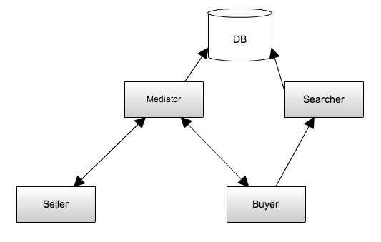
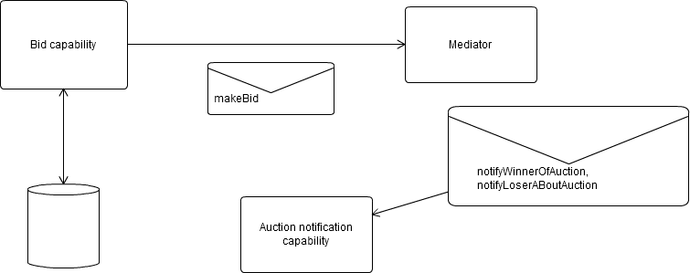
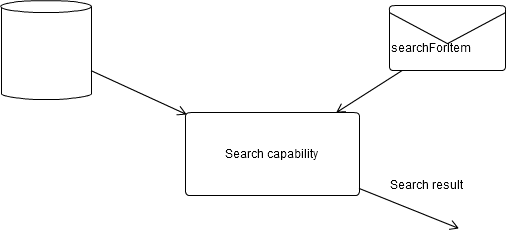
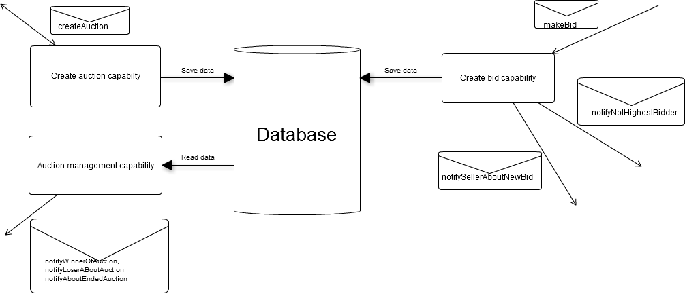
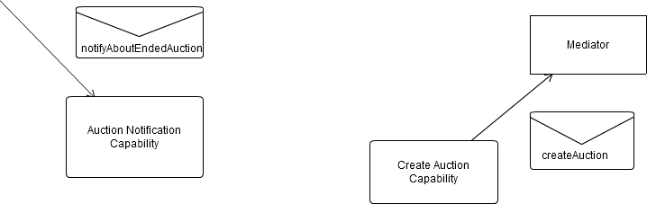

# Prometheus

## Scenarios

### User (Bidder / Seller)

#### Sell an item

Given I have an item that I want to sell  
When I go to the service desk and provide  
  a minimum price,  
  the end date for the auction  
  and a description  
Then I should receive a unique id representing the auction  

#### Bid and search auction

Given I search for a car  
When I select any given car and make my bid  
Then I should be able get a proper responds whatever my bid was valid or not  
If my bid is the highest after auction end date  
Then I win the auction  

#### Make a bid

Given I provde the follow params  
  an auction id  
  and a minimum price  
Then I should receive a status code  

#### Search for item

Given a search string  
When I execute the query  
Then I should be able to see a list all matched auctions  

### Mediator

#### Create an valid bid

Given  
  an auction id,  
  a price,  
  a user id,  
When I add a valid bid  
Then I return a status code equal to success  

#### Create an in-valid bid

Given  
  an auction id,  
  a price,  
  a user id,  
When I add an in-valid bid  
Then I return a status code equal to failed  

#### Auction ends with bids

Given I'm on the next tick  
When I list all actions  
  marked as "not finished"  
  and end date > current date  
Then I should  
  notify the higest bidder and owner for each action  
  and mark the given action as closed  

### Searcher

#### Search for auction

Given I'm provided with a search query  
When I process the query and pass the information to the database  
Then I should be able to return a list of matched auctions  

## System goals

- it should be possible to ...
  - search for auctions
  - create auctions
  - bid on auctions
  - notify users (seller and bidder) about auctions

## Agent descriptors

Name: Seller  
Description: offers items  
Cardinality: N/A  
Lifetime: Indefinite  
Create or destroyed: No  
Initialisation: Connect to database  
Functionalities included: none from the outside perspective  
Reads data: user profile  
Writes data: user profile  
Lifetime: Same life expectancy as the auction it self  
Interacts with: Mediator  
Demise: Delete all corresponding auctions  
Events:  
  - auction ends  
  - new bid  

---

Name: Bidder  
Description: makes bids for auctions  
Cardinality: N/A  
Lifetime: Indefinite  
Create or destroyed: No  
Initialisation: Connect to database  
Functionalities included: none from the outside perspective  
Reads data: user profile  
Writes data: user profile  
Interacts with: Mediator  
Demise: Delete all corresponding bidds  
Events:  
  - auction ends  
  - new higher bid  

---

Name: Mediator  
Description: starts autions, receives bids, declares winner  
Cardinality: Multiple based on dynamics of the system  
Lifetime: Indefinite  
Create or destroyed: No  
Initialisation: Connect to database  
Functionalities included: notifies users (bidders and sellers) about auctions, ends auctions, creates auctions, take bidds  
Reads data: user profile, auctions and bidds  
Writes data: auctions and bidds  
Demise: Restart it and send alert to administrator  
Data to keep track of: Auctions and bidds  
Events:  
  - Bidder makes a bid
  - Creation of an auction

---

Name: Searcher  
Description: receives search queries, searches through database  
Create or destroyed: No  
Cardinality: Multiple based on dynamics of the system  
Functionalities included: platform search engine  
Reads data: auctions  
Writes data: None  
Initialisation: Connection to database  
Lifetime: During search  
Demise: Nothing  
Data to keep track of: Auctions  
Events:  
  - search query

## Agent overview

## Capability descriptors

### Bidder

---

### Searcher

---

### Mediator

---

### Seller

## Data description

- notifyWinnerOfAuction()
  - Description: Called when bidder winns an auction
  - Initiator: Mediator
  - Partner: Bidder
  - Input: *{auction_id: Integer, price: Integer}*
  - Output: Void
- notifyLoserOfAuction()
  - Description: Called when bidder loses an auction
  - Initiator: Mediator
  - Partner: Bidder
  - Input: *{auction_id: Integer, price: Integer, winner_id: Integer}*
  - Output: Void
- notifyNotHighestBidder()
  - Description: Called when bidder doesn't have the higest bid
  - Initiator: Mediator
  - Partner: Bidder
  - Input: *{auction_id: Integer, price: Integer}*
  - Output: Void
- makeBid()
  - Description: Bid on an item
  - Initiator: Bidder
  - Partner: Mediator
  - Input: *{auction_id: Integer, price: Integer, bidder_id: Integer}*
  - Output: {status: STATUS}
- searchForItem()
  - Description: Search for an item
  - Initiator: Bidder
  - Partner: Searcher
  - Input: *{query: String}*
  - Output: *{item_id: Integer}*
- notifyAboutEndedAuction()
  - Description: Information about an ended auction
  - Initiator: Mediator
  - Partner: Seller
  - Input: *{auction_id: Integer, winner_id: Integer, price: Integer}*
  - Output: Void
- notifySellerAboutNewBid()
  - Description: Notify seller about new bidds on auction
  - Initiator: Mediator
  - Partner: Seller
  - Input: *{auction_id: Integer, bidder_id: Integer, price: Integer}*
  - Output: Void
- createAuction()
  - Description: Create auction for item
  - Initiator: Seller
  - Partner: Mediator
  - Input: *{description: String, seller_id: Integer, min_price: Integer}*
  - Output: Void

## Protocol

